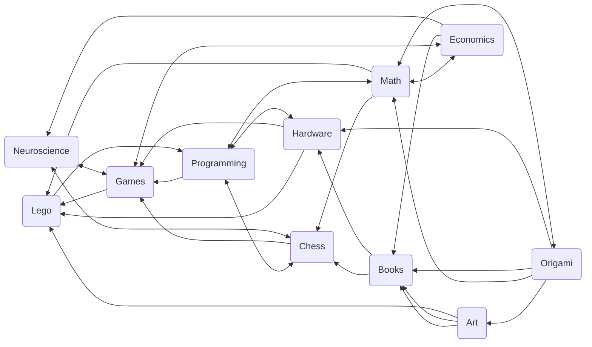

# **About Me:**
> I am a freshman at The Harker School, and I am interested in researching the connections between Chess, AI, Neuroscience, and Psychology. 

---

# Chess:
> For the past 8 years, I have been playing chess competitively. Over that time period, I have played both humans and chess engines, and I have been fascinated by how their playstyles compare to each other. The highly calculated moves of AlphaZero and Stockfish are in stark contrast to the more intuition-driven moves of humans. The decision-making process in chess fascinates me, and I have always been interested in understanding how options and trade-offs are processed in the human brain. 

---

# Programming & AI:
> To me, programming and AI represent the joy of creating. Last year, I was thinking about AI's power to not just infer, but also to create, which led to my project, [ArtI](https://docs.google.com/document/d/e/2PACX-1vRz2cqeF9WmZgbm9YWrUIa-mRcrLhHbm6jZXI6uiRI0E-jtML5swaIbGqhAyLPPAlzM24l1OEZRPaWB/pub), which leverages various APIs and a Gaussian Diffusion model to create art from audio and/or text. Bringing the saying "A picture is worth a thousand words" was a fun and fulfilling experience.

## Robotics:
> Robotics has given the opportunity to transfer my software skills to the real world. This year, I am on the robotics team at my school and I am excited to see my code actually running on our bot.

---

# Neuroscience:
> Chess got me thinking about decision making, both conscious and unconscious, under various states of pressure and preparedness. It also made me think about perception and its limits. I have been intrigued by how the human brain creates pathways for learning and decision making. Perception and objective reality and their role in decision making was also something that was probably triggered in equal parts by my interest in chess  and my lack of interest in eating broccoli. My being a foodie got me thinking about whether the brain could be tricked into believing I was eating ice-cream when I was actually holding a broccoli floret! Better understanding the connection between the brain and taste, this may help picky eaters, people who have lost their sense of taste, or those who have to take bitter medications.

---